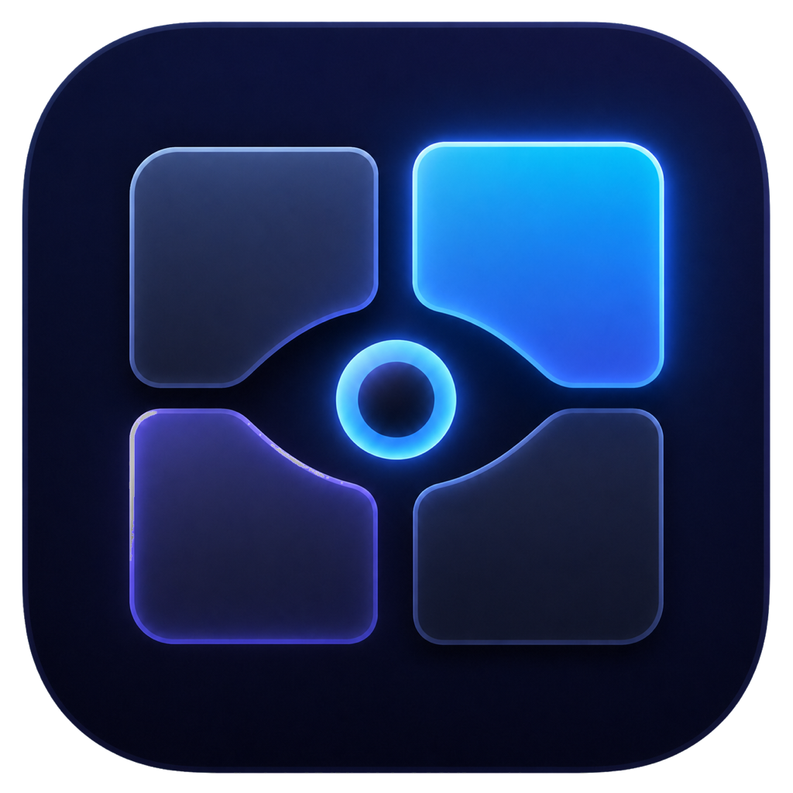
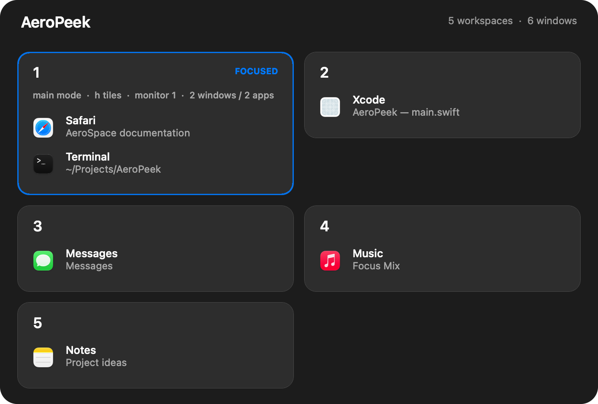
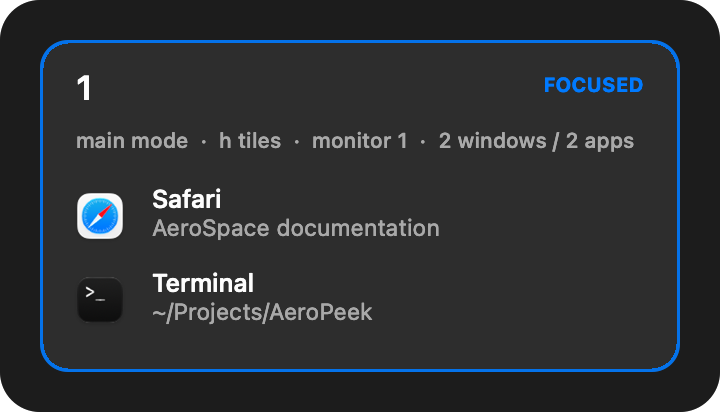
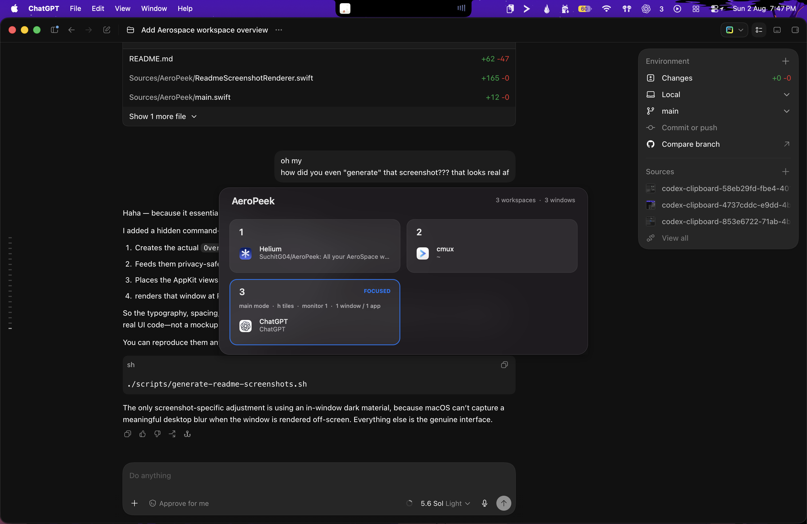

<p align="center">
  
</p>

<h1 align="center">AeroPeek</h1>

<p align="center">
  See every AeroSpace workspace at a glance.
</p>

<p align="center">
  A small, native macOS menu bar companion for remembering where your windows are.
</p>



AeroPeek gives you a quick visual map of your [AeroSpace](https://github.com/nikitabobko/AeroSpace) workspaces. Hold one shortcut to see the applications and window titles on each workspace, then release it to return to what you were doing.

## What it shows

- Applications and window titles grouped by workspace
- The currently focused and visible workspace
- Binding mode, container layout, monitor, window count, and app count
- Only useful workspaces by default—empty, inactive workspaces stay out of the way

The overview is read directly from AeroSpace each time it appears, so it reflects your current layout. AeroPeek has no Dock icon and stays quietly in the menu bar.

## Controls

| Action | Result |
| --- | --- |
| Hold <kbd>Control</kbd> + <kbd>Option</kbd> + <kbd>Space</kbd> | Show the overview until you release the shortcut |
| Double-tap <kbd>Space</kbd> while holding <kbd>Control</kbd> + <kbd>Option</kbd> | Pin the overview on screen |
| Press the shortcut while pinned | Dismiss the overview |

You can also pin or hide the overview from the menu bar, which is useful when inspecting your layout or taking a screenshot.

## Focused workspace context



The highlighted card adds the context that is easy to lose track of while tiling: the active AeroSpace binding mode, root layout, monitor number, and window and application counts.

### In the wild



<p align="center"><sub>AeroPeek, helpfully showing where AeroPeek was being built while we discussed how its screenshot was built.</sub></p>

## Install

You will need macOS 13 or newer, [AeroSpace](https://github.com/nikitabobko/AeroSpace), and the Xcode command-line tools.

```sh
git clone https://github.com/SuchitG04/AeroPeek.git
cd AeroPeek
./scripts/install.sh
open "$HOME/Applications/AeroPeek.app"
```

To launch AeroPeek automatically, add it under **System Settings → General → Login Items**.

The shortcut uses macOS's native global-hotkey registration, so AeroPeek does not need Accessibility permission. If another app already owns the shortcut, change it in the configuration file below, then use **Retry Shortcut Registration** from the menu bar or reopen AeroPeek.

## Configure the shortcut

Copy the example configuration to your user config directory:

```sh
mkdir -p "$HOME/.config/aeropeek"
cp config.example.json "$HOME/.config/aeropeek/config.json"
```

```json
{
  "modifiers": ["control", "option"],
  "keyCode": 49
}
```

Supported modifiers are `command`, `control`, `option`, and `shift`. `keyCode` is the macOS hardware key code; `49` is Space. Reopen AeroPeek after changing the file. Do not assign the same shortcut to AeroSpace itself, because AeroPeek needs to receive both the key-down and key-up events.

## Development

Build and open a local app bundle:

```sh
./scripts/build-app.sh
open ".build/AeroPeek.app"
```

The documentation screenshots are rendered from AeroPeek's real AppKit views with neutral sample data, so they can be regenerated without exposing anyone's desktop or window titles:

```sh
./scripts/generate-readme-screenshots.sh
```

The 1024-pixel icon source is in `Resources/AppIcon/AeroPeek-1024.png`. To rebuild the macOS icon bundle after editing it, run `./scripts/generate-icon.py` (Python 3 and Pillow required). The alternate muted icon is retained at `Resources/AppIcon/AeroPeek-subtle-1024.png`.
